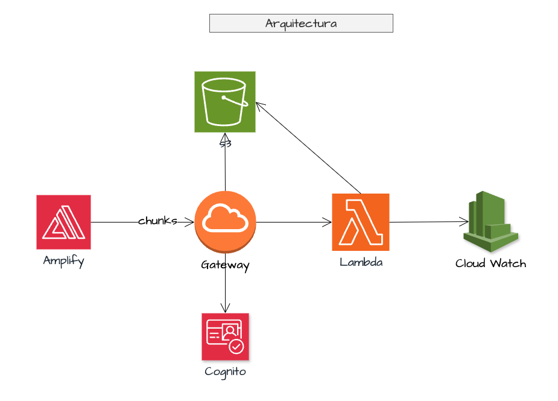
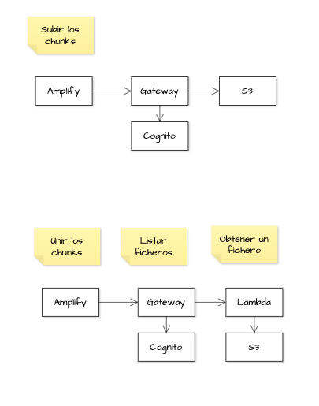

# Run this project in AWS

### Prerequisites
- AWS account
- AWS CLI
- Terraform

[Install Terraform](https://developer.hashicorp.com/terraform/tutorials/aws-get-started/install-cli)

### Steps
1. Create a new IAM user with admin access
2. Configure the AWS CLI with the new user credentials
3. Clone this repository
4. Go to the project directory
5. Run `terraform init`
6. Run `terraform apply`

### High-level overview

### Detailed overview

### Notes
- The default region is `us-west-2`. You can change it in the `variables.tf` file.
- Tested using a macOS machine. If you are using Windows, you may need to change the `terraform` command to `terraform.exe` in the `Makefile` file.
